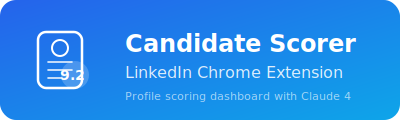

<p align="center">
  
</p>

A collection of five intelligent recruiting tools that automate sourcing, scoring, mapping, communication, and intake workflows for modern talent acquisition teams. Each project leverages Claude 4 to transform how recruiters find, evaluate, and engage candidates.

---

## Projects

### 1. X-Ray Sourcing Pipeline


End-to-end sourcing automation that takes a job description and delivers a ranked candidate pipeline — no manual searching required.

**What it does:**
- Parses job descriptions to extract key requirements, skills, and qualifications
- Generates optimized Google X-Ray and Boolean search strings
- Scrapes candidate profiles from search results
- Scores each candidate against JD requirements
- Produces an interactive sourcing dashboard with Excel export

**Key Features:**
- Automated JD parsing and requirement extraction
- Multi-query X-Ray search string generation
- Candidate profile scraping and deduplication
- Weighted scoring engine aligned to role requirements
- Interactive dashboard with filters, sorting, and visual analytics
- One-click Excel export for ATS integration

---

### 2. Talent Intelligence & Company Mapper


Strategic sourcing intelligence that analyzes any job description and maps out the ideal companies to recruit from — complete with scoring, rationale, and prioritization.

**What it does:**
- Analyzes a JD to identify 12-20 target companies ranked by relevance
- Scores each company on Match (0-100) and Poachability (0-100)
- Provides fit tags, sourcing rationale, and cross-industry talent pools
- Delivers a prioritized must-target list for recruiter action

**Key Features:**
- Dual-axis scoring: Match fit and Poachability assessment
- Company fit tags for quick filtering (e.g., direct competitor, adjacent industry)
- Detailed sourcing rationale per company
- Cross-industry talent pool identification for non-obvious sourcing angles
- Prioritized must-target shortlist with actionable next steps

---

### 3. LinkedIn Candidate Scorer


A Chrome extension (Manifest V3) that overlays a real-time scoring dashboard directly onto LinkedIn profile pages, turning passive browsing into data-driven candidate evaluation.

**What it does:**
- Parses LinkedIn profile DOM data in real time
- Evaluates candidates across 10 weighted scoring dimensions
- Displays an overlay dashboard with scores and breakdowns
- Includes a floating comparison panel for side-by-side evaluation

**Key Features:**
- Manifest V3 Chrome extension architecture
- Real-time LinkedIn DOM parsing and data extraction
- 10 configurable weighted scoring dimensions
- Visual score dashboard overlaid on profile pages
- Floating comparison panel for multi-candidate evaluation
- Non-intrusive UI that integrates seamlessly with LinkedIn

---

### 4. RecruiterKeys Communication Platform


A Chrome extension with a Raycast-style command palette that gives recruiters instant access to 50+ professionally crafted message templates — with smart insertion into any messaging platform.

**What it does:**
- Provides a keyboard-shortcut-driven command palette for rapid template access
- Offers 50+ message templates spanning 10 hiring stages
- Supports 5 tone modes and 5 channel formats for context-appropriate messaging
- Smart-inserts messages directly into LinkedIn, WhatsApp, Gmail, and any text field

**Key Features:**
- Raycast-style command palette with fuzzy search
- 50+ message templates across 10 recruitment stages (sourcing, screening, scheduling, offer, onboarding, and more)
- 5 tone modes (formal, friendly, casual, urgent, executive)
- 5 channel formats (email, LinkedIn InMail, WhatsApp, SMS, Slack)
- Smart insertion into LinkedIn chat, WhatsApp Web, Gmail compose, and contentEditable fields
- Fully keyboard-driven workflow for maximum recruiter speed

---

### 5. Intake Meeting — Recruiter Hub


A centralized intake meeting platform that streamlines the recruiter-hiring manager alignment process, ensuring every search kicks off with clarity, structure, and shared expectations.

**What it does:**
- Provides a structured intake meeting framework for recruiters and hiring managers
- Captures role requirements, must-haves, nice-to-haves, and deal-breakers
- Generates standardized intake summaries for consistent handoffs
- Tracks meeting outcomes and action items

**Key Features:**
- Structured intake meeting templates and guided workflows
- Role requirement capture with priority weighting
- Hiring manager alignment scoring and gap identification
- Auto-generated intake summaries and search briefs
- Action item tracking and follow-up reminders
- Integration-ready output for sourcing pipeline kickoff

---

### 6. Interviewly — AI Interview Scheduler

[](/100rabs/Claude-TA/blob/main/interview-scheduler)

A full-stack interview management platform with first-class bias mitigation and calendar intelligence — schedules panels by computing overlapping availability across calendars, runs every feedback submission through a bias lexicon, and surfaces panel disagreements before they bias decisions.

**What it does:**

* Schedules interviews by finding overlapping free/busy windows across multi-panel calendars
* Enforces blind review for panelists until feedback is submitted
* Runs every written feedback through a 7-category bias lexicon scan
* Detects panel disagreements (score spread + conflicting recommendations)
* Surfaces anonymised panelist calibration (lenient vs. harsh) and aggregate diversity pass-through

**Key Features:**

* Six configurable interview stages (screening → R1 → R2 → R3 → presentation → hiring manager)
* Overlapping-availability slot finder with mock Google Calendar / Outlook providers
* Structured rubric scoring gate — free-text locks until all criteria are scored
* Bias Lab with six dashboards: Flagged Feedback, Blind Review, Calibration, Panel Consistency, Diversity Signal, Rubrics
* Role switcher (Recruiter / Panel / Candidate) with auto-blind-review for panelists
* Single-file HTML prototype for zero-install demos
* Full React + FastAPI + Postgres stack behind Docker Compose for production builds
* Pluggable Protocol-based provider layer (Calendar, Email, Bias detection, Transcription)

---

## Tech Stack

| Layer | Technologies |
|---|---|
| AI | Claude 4 (Anthropic) |
| Frontend | HTML, CSS, JavaScript, React |
| Extensions | Chrome Extensions (Manifest V3) |
| Data | Python, Web Scraping, Excel/CSV Export |
| Search | Google X-Ray, Boolean Logic |

---

## Repository Structure

```
Claude-TA/
├── README.md
├── assets/                            # Logo SVG files
├── xray-sourcing-pipeline/            # Project 1 — X-Ray Sourcing Pipeline
├── company-mapper/                    # Project 2 — Talent Intelligence & Company Mapper
├── linkedin-candidate-scorer/         # Project 3 — LinkedIn Candidate Scorer
├── recruiterkeys-extension/           # Project 4 — RecruiterKeys Communication Platform
└── intake-meeting-recruiter-hub/      # Project 5 — Intake Meeting — Recruiter Hub
└── interview-scheduler/               # Project 6 — AI Interview Scheduler with bias mitigation
```

---

## Getting Started

Each project lives in its own directory with dedicated setup instructions. Navigate into any project folder and follow its local README for installation and usage.

```bash
git clone https://github.com/100rabs/Claude-TA.git
cd Claude-TA
```

---

## Author

**100rabs** — *Coding to find coders!*

[](https://github.com/100rabs)

---

## License

This project is licensed under the MIT License. See individual project directories for details.
